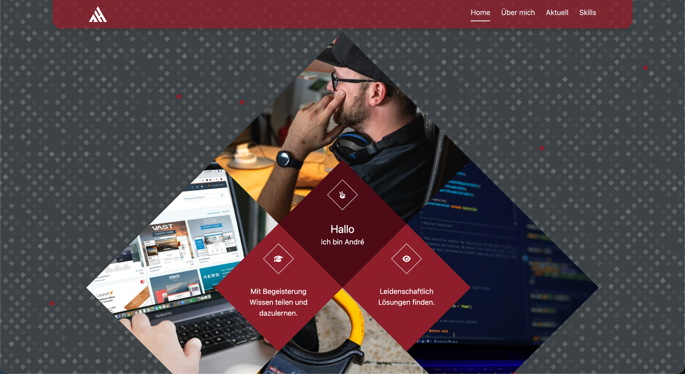
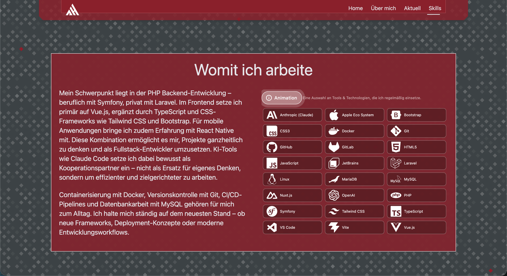
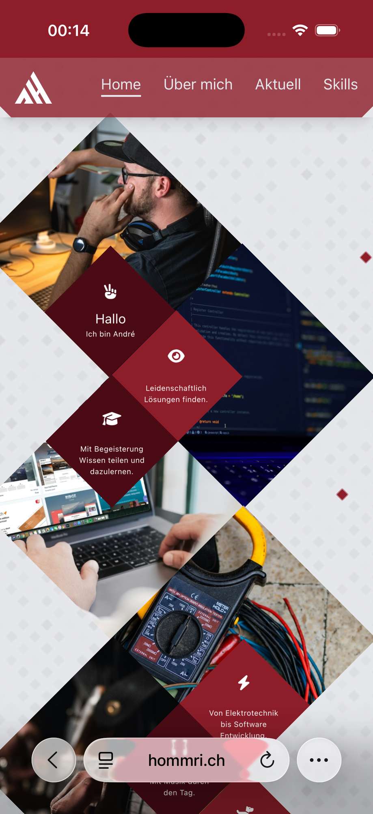
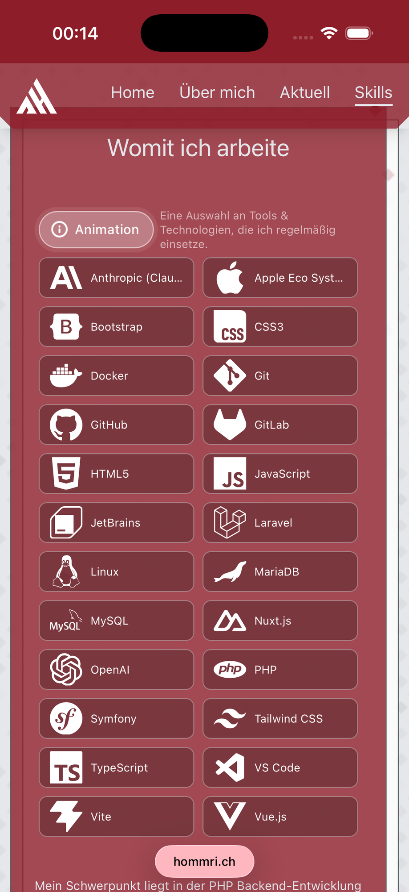

# ahommrichnuxt

[](https://github.com/AHommrich/ahommrichnuxt/actions/workflows/lint.yml)
[](https://github.com/AHommrich/ahommrichnuxt/actions/workflows/typecheck.yml)
[](https://github.com/AHommrich/ahommrichnuxt/actions/workflows/test.yml)
[](LICENSE)

Personal portfolio of André Hommrich — Fullstack developer from the Westerwald. Nuxt 3, Vue 3, Tailwind CSS 4, deployed via Docker + Coolify. Live at **[ahommrich.de](https://ahommrich.de)** and **[hommri.ch](https://hommri.ch)**.

> 🇩🇪 Auch auf Deutsch verfügbar: [README.de.md](README.de.md)









---

## Feature highlights

Sorted from "engineering-interesting" to "UX polish". Each item links to the file that implements the mechanism.

1. **`requestAnimationFrame` physics with pointer-flee and info-mode** — one rAF loop drives 21 icons through a `x, y, vx, vy` model, flees from the pointer within a 120 px radius, and reshapes into an alphabetical card grid on demand. Replaced a GSAP implementation for mobile performance. Touch and pointer events are handled separately so mobile scroll doesn't trigger flee, and the loop is paused via `IntersectionObserver` when the section leaves the viewport.
   → [`components/AppTechSection.vue`](components/AppTechSection.vue)

2. **Rotated 8-tile diamond grid in the hero** — desktop uses a rotated CSS grid with `overflow: hidden` per tile. Mobile falls back to stacked squares with a documented subpixel-gap fix (`translateZ(0) scale(1.005)` + `backface-visibility: hidden`) because iOS Safari renders half-pixel seams between the tiles otherwise.
   → [`components/AppHeroSection.vue`](components/AppHeroSection.vue)

3. **Sticky header with `IntersectionObserver`-driven active section** — the header highlights the current section without scroll listeners; the slider under the nav has been perf-tuned across five iterations for mobile.
   → [`components/AppHeader.vue`](components/AppHeader.vue)

4. **No third-party trackers, cookieless analytics** — no CDN, no Google Fonts, no external marketing scripts. FontAwesome is bundled locally and tree-shaken; the tech section uses local Simple Icons SVGs. The only external script is the self-hosted, cookieless analytics tool **Umami** (`analytics.hommrich.app`) — no cookies, no device IDs, no profiling, hence no consent banner (§&nbsp;25 TDDDG, Art.&nbsp;6(1)(f) GDPR). Only active when `NUXT_PUBLIC_UMAMI_*` is set.
   → [`nuxt.config.ts`](nuxt.config.ts), [`plugins/fontawesome.client.js`](plugins/fontawesome.client.js)

5. **Tailwind CSS 4 via `@tailwindcss/vite`** — no `tailwind.config.js`; theme tokens live in the CSS via `@theme`. Dark mode via Tailwind's `dark:` classes throughout.
   → [`assets/css/main.css`](assets/css/main.css), [`nuxt.config.ts`](nuxt.config.ts)

---

## Tech stack

| Layer                | Technology                                                  |
| -------------------- | ----------------------------------------------------------- |
| Framework            | Nuxt 3 + Vue 3 + TypeScript                                 |
| Styling              | Tailwind CSS 4 (`@tailwindcss/vite`) — no config file       |
| Icons (UI)           | FontAwesome (client-only via Nuxt plugin)                   |
| Icons (Tech section) | Simple Icons — local SVGs in `public/icons/`                |
| Animations           | `requestAnimationFrame` loop (no GSAP)                      |
| Runtime              | Node 20 (`.nvmrc`)                                          |
| Deploy               | Docker + Coolify (Traefik reverse proxy, Let's Encrypt TLS) |

---

## Quick start

```bash
nvm use              # picks up Node 20 from .nvmrc
npm ci               # reproducible install (uses package-lock.json)
npm run dev          # dev server on http://localhost:3000
```

### Available scripts

| Command             | What it does                                  |
| ------------------- | --------------------------------------------- |
| `npm run dev`       | Dev server with HMR                           |
| `npm run build`     | Production build (Nitro `node-server` preset) |
| `npm run generate`  | Static site generation                        |
| `npm run preview`   | Serve the production build locally            |
| `npm run lint`      | ESLint + Prettier check                       |
| `npm run lintfix`   | ESLint autofix + Prettier write               |
| `npm run typecheck` | `nuxt typecheck` via `vue-tsc`                |

---

## Deployment

Production runs on **Coolify** (self-hosted PaaS) with **Traefik** as reverse proxy and Let's Encrypt for TLS. Deploys are triggered by pushing to `main`; Coolify pulls the repo, builds the image from the [`Dockerfile`](Dockerfile), and swaps the running container.

For a local production check: `npm run build && npm run preview`.

---

## Project structure

```
components/    App*.vue — Header, HeroSection, AboutSection, TechSection, Footer, Card, …
pages/         index.vue, impressum.vue, datenschutz.vue
layouts/       default.vue
plugins/       fontawesome.client.js — FontAwesome setup (client-only)
public/        img/ (portfolio photos), icons/ (21 Simple Icons SVGs)
assets/css/    main.css — Tailwind entry
```

A more opinionated walkthrough of the animation system, mobile fixes, and conventions lives in [`CLAUDE.md`](CLAUDE.md) (context for AI assistants working on the repo).

---

## Architecture (short version)

Single Nuxt 3 app in SSR mode with the `node-server` Nitro preset. Pages are static content; there is no API layer, no database, no auth. The animation-heavy components (`AppTechSection`, `AppHeroSection`, `AppHeader`) run entirely on the client and are self-contained — no store, no composables shared between them.

---

## GDPR / data protection

- **No cookies, no third-party trackers.** Analytics exclusively via self-hosted, cookieless Umami (§ 25 TDDDG compliant, no consent banner).
- **No third-party runtime assets.** FontAwesome + Simple Icons are bundled locally.
- Imprint at [`/impressum`](https://ahommrich.de/impressum) (TMG § 5)
- Privacy policy at [`/datenschutz`](https://ahommrich.de/datenschutz) (Art. 13 GDPR)

---

## License

All rights reserved. The code is public for review and reference but is not licensed for reuse. If you would like to use a component or the setup, open an issue and ask.
